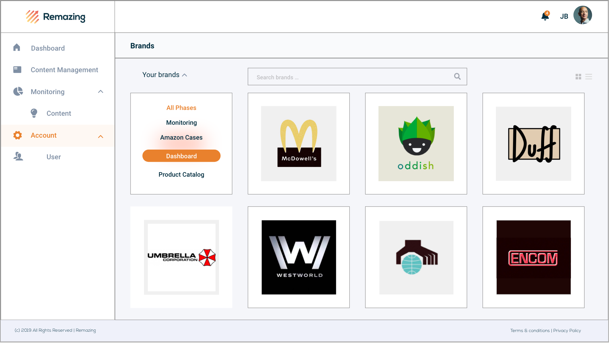

# Remazing HR-Challenge-react

## AdobeXd Mockup
- Web app layout  (as it simulates a web-app software I didn't create mobile optimated styles)

## Setup
- This project was bootstrapped with [Create React App](https://github.com/facebook/create-react-app).

- For styling I used styled-components

## Server
- For mocking the clients data into a JSON I installed the JSON-Dev-dependencies:  `npm install -D json-server`
- The data is saved in the db.json file and listen on port 4000 (configured in package.json)

## How to run the Scripts

- To start the server, you can run in the project directory: 

### `npm run fake-api`

- In the project directory, you can run:

### `npm start`

- It runs the app in the development mode.
- Open [http://localhost:3000](http://localhost:3000) to view it in the browser.

- The page will reload if you make edits.
- You would also see any lint errors in the console (though I hope that there will be none).

